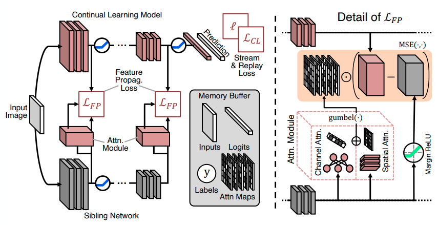

<h1 align="center">
Transfer without Forgetting<br/>ECCV 2022
</h1>

[Paper link on ArXiv](https://arxiv.org/pdf/2206.00388.pdf) • Powered by [Mammoth](https://github.com/aimagelab/mammoth)

<p align="center">
  
</p>

## Instructions

- use `utils/main.py` to launch an experiment
- The `load_cp` argument defines the path where your initialization checkpoint for a given pre-training dataset will be downloaded. By default, it is a random path in /tmp/, specify a fixed path if you want to reuse a single checkpoint.

## Citation

```@inproceedings{boschini2022transfer,
    title={Transfer without Forgetting},
    author={Boschini, Matteo and Bonicelli, Lorenzo and Porrello, Angelo and Bellitto, Giovanni and Pennisi, Matteo and Palazzo, Simone and Spampinato, Concetto and Calderara, Simone},
    booktitle={European Conference on Computer Vision},
    year={2022}
}
```